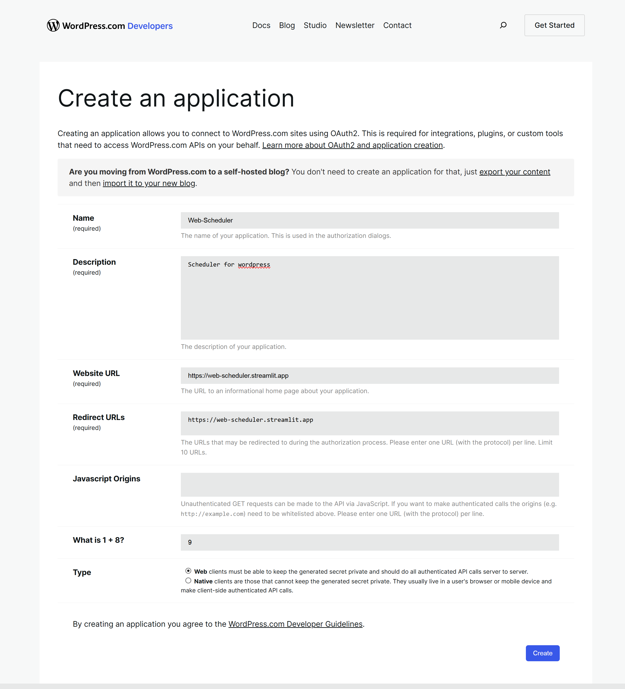
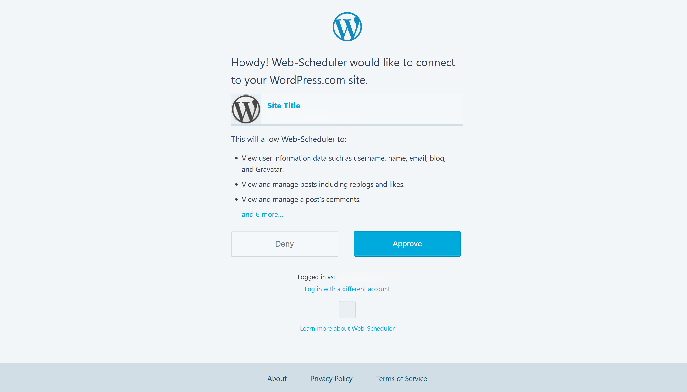
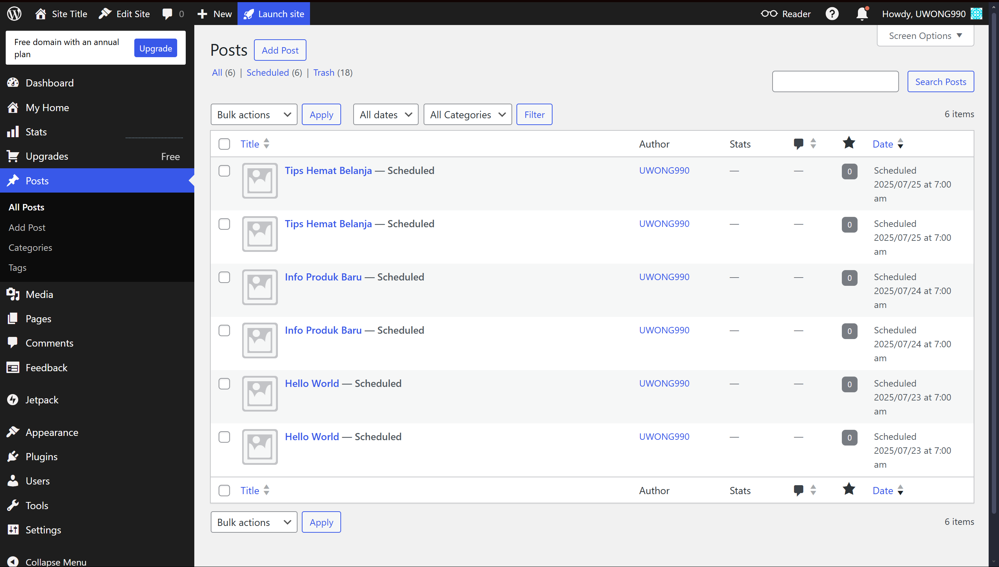

# 🗓️ WordPress Auto Post Scheduler (Streamlit Web)

[](https://web-scheduler.streamlit.app)

Web ini adalah aplikasi berbasis Streamlit yang memungkinkan pengguna untuk menjadwalkan posting artikel ke situs WordPress.com secara otomatis menggunakan file Excel (`posts.xlsx`) sebagai basis datanya. Proses autentikasi menggunakan OAuth2 dengan WordPress Public API.

---

## 🚀 Fitur Utama

- 🔒 Autentikasi OAuth2 via WordPress (menggunakan Client ID dan Secret)
- 📂 Upload file Excel berisi daftar post
- ⏳ Menjadwalkan posting otomatis berdasarkan tanggal publish
- 💬 Menampilkan log hasil posting (berhasil / gagal)
- ✅ Mendukung tag dan konten HTML
- 🔗 Menggunakan API resmi WordPress.com (`rest/v1.1/sites/...`)

---

## 📁 Format File Excel (`posts.xlsx`)

File yang diunggah harus memiliki kolom:

| judul             | konten_html                  | tag              | tanggal_publish |
|------------------|------------------------------|------------------|-----------------|
| Hello World       | `<p>Selamat datang!</p>`     | berita, umum     | 2025-07-01      |

- `judul`: Judul artikel
- `konten_html`: Isi konten dalam format HTML
- `tag`: Daftar tag dipisahkan koma
- `tanggal_publish`: Tanggal publish dalam format `YYYY-MM-DD`

---

## 🔐 OAuth2 Configuration (WordPress Developer Console)

Membutuhkan:
- Client ID
- Client Secret
- Redirect URI → ```https://web-scheduler.streamlit.app```

### 🌐 OAuth2 Endpoints

**URL Otorisasi:**  
```
https://public-api.wordpress.com/oauth2/authorize?client_id={Client_id}&redirect_uri=https://web-scheduler.streamlit.app&response_type=code
```

**URL Token Exchange:**  
```
https://public-api.wordpress.com/oauth2/token
```


---

## ▶️ Cara Menjalankan

1. Buat apps baru di https://developer.wordpress.com/apps/new untuk mendapatkan Client ID dan Client Secret
2. Isi semua yang diperlukan dan pastikan Redirect URL adalah https://web-scheduler.streamlit.app 
3. Buka browser ke https://web-scheduler.streamlit.app
4. Isi Client id dan Client secret untuk mendapatkan Access Token
5. Ikuti petunjuk dan setujui, Anda akan melihat tampilan seperti berikut:  
    
6. Isi kembali semua form yang diperlukan dan upload file xlsx anda
7. Akan muncul log status posting di bawah form, dan posting akan masuk ke dashboard admin wordpress.  
Contoh tampilan dashboard admin WordPress setelah posting berhasil:  

